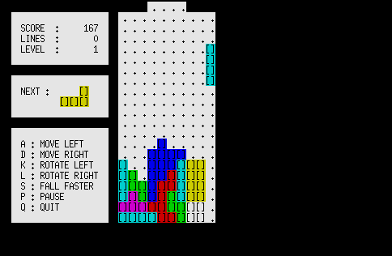

AWKTC
=====



**A**WKTC is **W**orkable **K**lutzy **T**etris **C**lone

Description
-----------

**AWKTC** is a Tetris clone in AWK.

Requirements
------------

* `gawk` or `awk`
* [GNU coreutils](https://www.gnu.org/software/coreutils/) or equivalent BSD command (`dd`, `echo`, `sleep`, `stty`)

How to Play
-----------

### Running the Game ###

``` shellsession
$ cd /path/to/AWKTC
$ ./awktc.awk
```

### Controls ###

* <kbd>a</kbd>: Move left
* <kbd>d</kbd>: Move right
* <kbd>k</kbd>: Rotate left
* <kbd>l</kbd>: Rotate right
* <kbd>s</kbd>: Fall faster
* <kbd>p</kbd>: Pause
* <kbd>q</kbd>: Quit

Changing the Playfield Width
----------------------------

You can change the playfield width between 4 and 24 cells.

### Example Minimum Width ###

``` shellsession
$ ./awktc.awk 4
```


### Example Maximum Width ###

``` shellsession
$ ./awktc.awk 24
```


Installation
------------

``` shellsession
$ git clone https://github.com/mikkun/AWKTC.git
```

Author
------

[KUSANAGI Mitsuhisa](https://github.com/mikkun)

License
-------

[MIT](./LICENSE)
