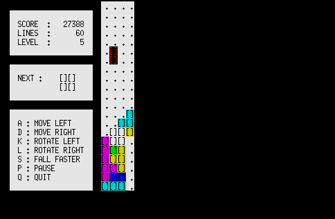

AWKTC
=====


**A**WKTC is **W**orkable **K**lutzy **T**ime-wasting **C**ommand

Description
-----------

**AWKTC** is a Tetris-like tile-matching puzzle game written in AWK.

Requirements
------------

* `gawk` or `awk` (except `mawk`)
* [GNU coreutils](https://www.gnu.org/software/coreutils/) or equivalent BSD command (`dd`, `echo`, `sleep`, `stty`)

Supported Platforms
-------------------

**AWKTC** has been tested in the following platforms:

* Debian GNU/Linux 9
* FreeBSD 11.1-RELEASE

How to Play
-----------

### Running the Game ###

``` shellsession
$ cd /path/to/AWKTC
$ ./awktc.awk
```

### Controls ###

* <kbd>a</kbd>: Move left
* <kbd>d</kbd>: Move right
* <kbd>k</kbd>: Rotate left
* <kbd>l</kbd>: Rotate right
* <kbd>s</kbd>: Fall faster
* <kbd>p</kbd>: Pause
* <kbd>q</kbd>: Quit

### Beneficial Item ###

*  - __Special Piece__ - Destroys horizontal lines even if they have gaps of blocks.

Changing the Playfield Width
----------------------------

You can change the playfield width between 4 and 24 cells.

By default, the playfield width is 12 cells.

### Example Minimum Width ###

``` shellsession
$ ./awktc.awk 4
```



### Example Maximum Width ###

``` shellsession
$ ./awktc.awk 24
```


Installation
------------

``` shellsession
$ git clone https://github.com/mikkun/AWKTC.git
```

Author
------

[KUSANAGI Mitsuhisa](https://github.com/mikkun)

License
-------

[MIT](./LICENSE)
